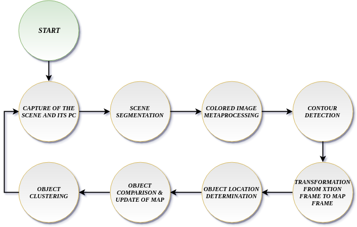
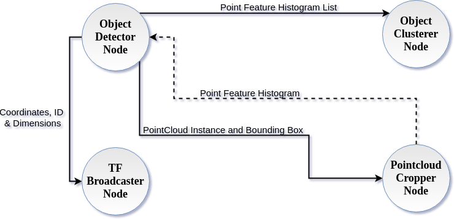

# 2017_B_depth_object_clustering
This code was developed under the work of my Thesis with title *"Automatic detection and clustering of arbitrary objects using image data and depth information"*. The code is able to:
1. Detect objects of arbitrary shape through image data and depth information.
2. Specify the location of detected objects on the map.
3. Group the detected objects by shape.

The Finite State Machine (FSM) of the system is:


The node diagram is the following:


## Getting Started

These instructions will get you a copy of the project up and running on your local machine for development and testing purposes. See deployment for notes on how to deploy the project on a live system.

### Prerequisites
```
Linux (Kernel >= 4.13.0-45-generic)
Python (Version >= 3.3)
NumPy (Version >= 1.8.2)
ROS (Version = Kinetic Kame)
```

### Installing
[Installation instructions for ROS Kinetic ](http://wiki.ros.org/kinetic/Installation/Ubuntu)
```
sudo apt-get install numpy python-yaml
sudo apt-get install python-opencv
pip install -U scikit-learn
```

## Built With

* [ROS](http://www.ros.org/) - The Robot Operating System as a flexible framework for writing the robot software
* [OpenCV](https://opencv.org/) - Open Source Computer Vision Library
* [PCL](http://pointclouds.org/) - Library for 2D/3D image and point cloud processing
* [scikit-learn](http://scikit-learn.org/stable/index.html) - Machine Learning in Python


## Author
* **Eleftherios Mylonakis** - *Code and thesis writing* - [lefos99](https://github.com/lefos99)

## Acknowledgments
* **Manos Tsardoulias** - *Guidance during Thesis writing* - [lefos99](https://github.com/etsardou)
